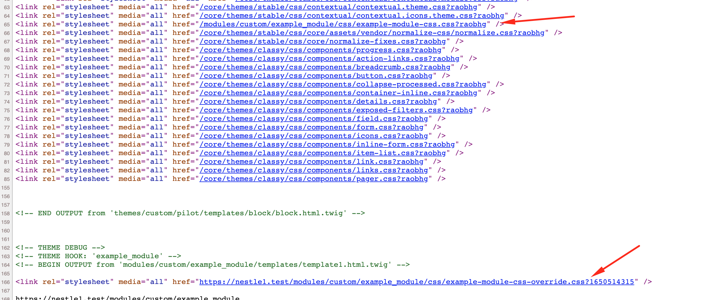
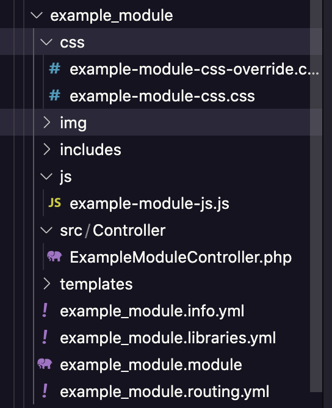
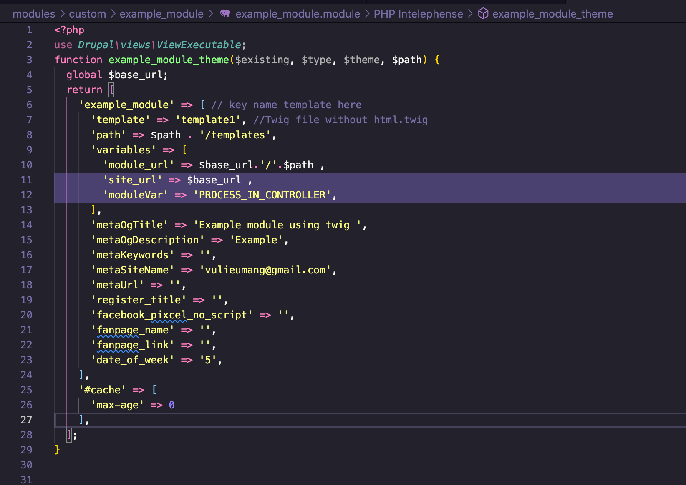
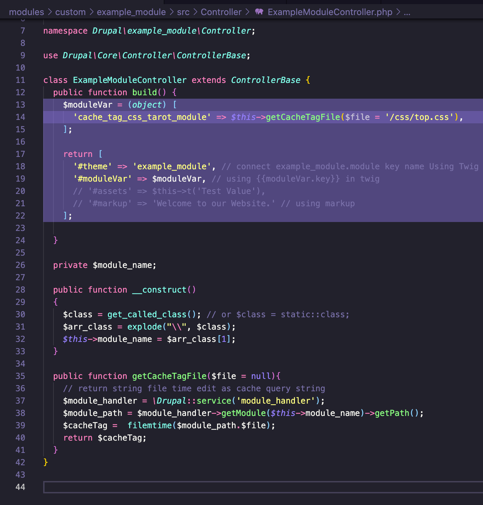
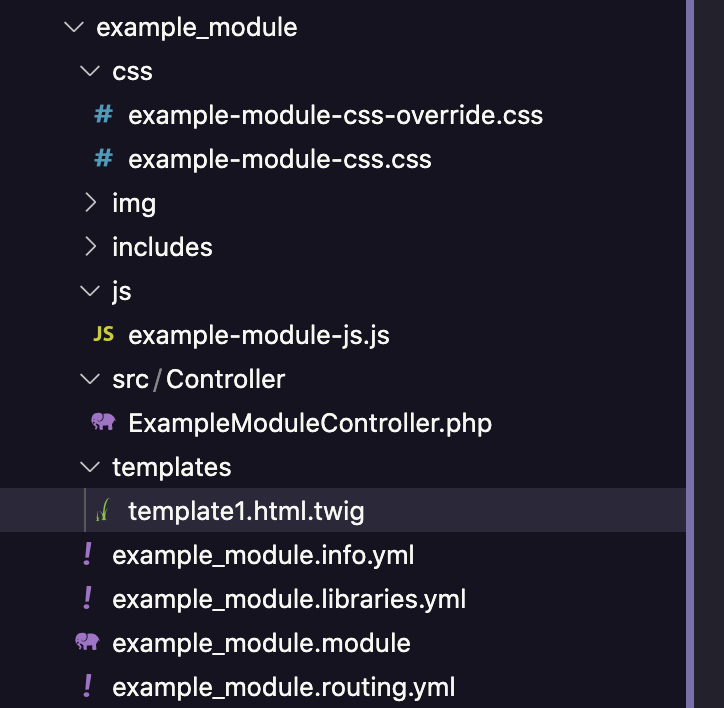

#update:5/2022
có thể sử dụng hàm [module_name]_js_alter và [module_name]_css_alter để loại bỏ js, css ko muốn load vào page
# Drupal module load css js under css base theme
 Drupal example module load css js under css base theme - drupal 8 9

load css js in module under css base theme and using dynamic cache when change css, js content



use: copy folder example_module in this repo and paste to modules/custom/[this_module]

===

Lý do sử dụng vì khi chèn css bằng cơ chế mặc định của module trong file  .libraries.yml thì file css nằm trên css theme base và bị ghi đè dẫn đến sai style chúng ta làm cho module
// sau khi setup 1 module với cấu trúc thư mục chuẩn

// link example module trên github


template.twig

```
<link rel="stylesheet" media="all" href="{{module_url}}/css/top.css?{{moduleVar.cache_tag_css_tarot_module}}" />
```


Giải thích:
{{module_url}} : được lấy từ .module
{{moduleVar.cache_tag_css_tarot_module}} : lấy từ controller

example_module.module

Giải thích:
khai báo từ biến moduleVar trong .module 
phải khai báo biến này trước, và được sử dụng lại trong controller

ExampleModuleController.php


Giải thích:
{{moduleVar.cache_tag_css_tarot_module}} : 
ở controller ta sẽ sử dụng biến này như một obj để có thể chèn nhiều giá trị để đưa vào template twig

ở đây ta chèn thêm thêm key "cache_tag_css_tarot_module" để lưu giá trị "file time"  (thời gian edit file gần nhất) để tận dụng cache file trên trình duyệt, và chỉ thay đổi khi ta thay đổi file css đó, có thể thêm các file khác như js
chỉ hoạt động khi có max-age 0 trong module
```
'#cache' => [
      'max-age' => 0
    ],
```
Thành quả


cấu trúc module sau khi hoàn thành




=====
Đang  phát triển:
vẫn chưa tối ưu nhất vì:
1. ko tận dụng đc cơ chế cache drupal cho module, chúng ta sử dụng cache bằng lần thay đổi file gần nhất vì ko get được giá trị query string cache
2. 
như chèn css bình thường bằng file libraries.yml thì có tận dụng cache drupal nhưng lại bị ghi đè bới css theme base vì css module xuất hiện trước theme base

nên chúng ta sử dụng cách trên
cách tốt nhất mong muốn:
1. chèn css module bên dưới css theme base có cơ chế clear cache
2. loại bỏ các css ko mong muốn khi ở page module
có thể cần xử lý ở theme.
nếu là chủ website thì tìm cách xử lý ở theme,
nếu chỉ là code 1 module thì cần tìm cách tối ưu cho module
